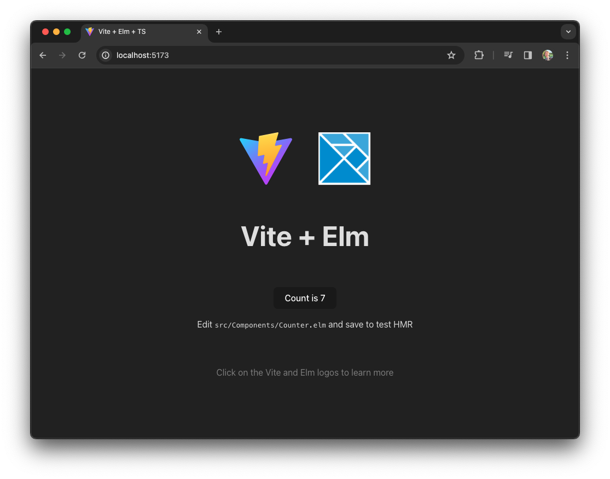
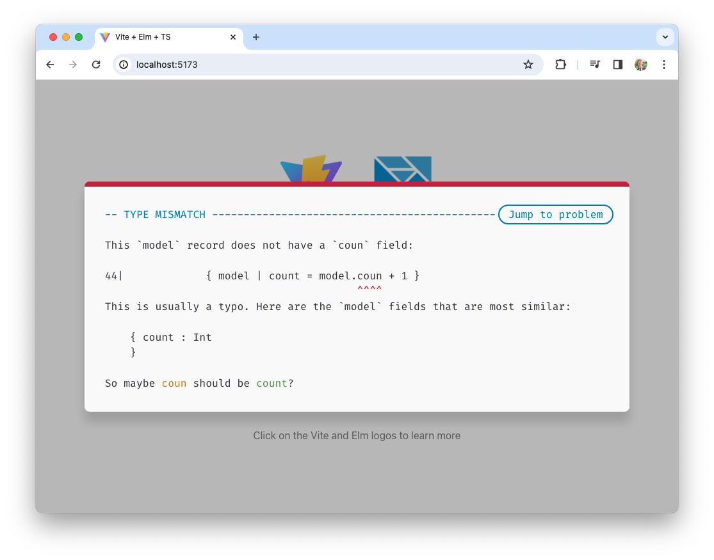

# vite-plugin-elm-watch

> __🚨 Warning:__ This plugin is still experimental, and doesn't quite work as intended. Publishing here to share progress and work through minor bugs!

Use [Vite](https://vitejs.dev) and [Elm](https://elm-lang.org) with reliable HMR and full-color error messages!

## Installation

```bash
npm install -D vite-plugin-elm-watch
```

## Usage

```js
// vite.config.js
import { defineConfig } from 'vite'
import elm from 'vite-plugin-elm-watch'

export default defineConfig({
  plugins: [elm()]
})
```

```js
// In src/main.js
import Main from './src/Main.elm'

let app = Main.init()
```

## Features

- __Import `*.elm` files__ directly from JavaScript or TypeScript
- __Reliable HMR__ powered by [_elm-watch_](https://lydell.github.io/elm-watch/)
- __Full-color__, friendly compiler messages in the browser
- __Jump to problem__ from your browser in one click
- __JS minification__ step is included
- __React output mode__ for easy interop with existing components

### Screenshots







## Options

### `mode`

When using [the official Elm CLI](https://guide.elm-lang.org/install/elm.html), you have access to flags that can add Elm's time-traveling debugger, or optimize your code for production.

This plugin also adds a few additional options for minifying compiled code for production and provides nice defaults in development.

```ts
  'auto'     // Uses "debug" in development and "minify" in production
| 'standard' // Doesn't add any Elm compiler flags
| 'debug'    // Adds the `--debug` flag
| 'optimize' // Adds the `--optimize` flag
| 'minify'   // Adds the `--optimize` flag and minifies the JS output
```

### `output`

```ts
  'default'  // Exports standard object with "init" function
| 'react'    // Exports a React component that can be dropped into an existing app
```

This option allows you to specify what your imported Elm code will return. For React apps, we recommend using the `'react'` output so you can easily swap `.jsx/.tsx` files with `.elm` and things will just work ™️.

__Warning:__ Still working through HMR bugs before this is production ready!


### `isBodyPatchEnabled`

```ts
isBodyPatchEnabled : boolean
```

In production, you might encounter issues caused by third party JS that modify the `<body>` element. This only is a problem for folks using `Browser.application`, which expects control over the entire `<body>` element.

By enabling `isBodyPatchEnabled: true`, you'll be able to specify a custom root node. This uses Elm's standard `node` field when initializing the app:

```js
// src/main.js
import Main from './src/Main.elm'

let app = Main.init({
  node: document.getElementById('elm_root')
})
```

__Note:__ This will only work if the element has an `id` attribute.

A known issue is that Elm will clear out attributes for this root element, so `id="elm_root"` won't be visible after Elm loads.

